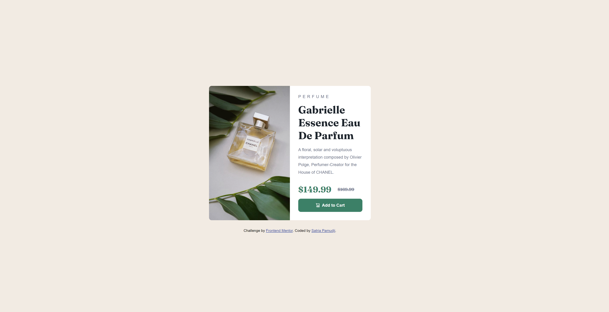

# Frontend Mentor: Product Preview Card Component

## Overview

[Product Preview Card Component](https://www.frontendmentor.io/challenges/product-preview-card-component-GO7UmttRfa)

In this challenge, we had to create a product preview card component to make it look at close as the given product images.

For this project, I built it with these:

- Semantic HTML5 Markup
- CSS custom properties
- Flexbox

### What I learned

This project was a bit of a challenge for me initially as I was just getting used to the whole HTML and CSS language. Here was the problems I faced:

1. The first problem I faced was with the scaling of the image on the left, as when I did "height: 100%", the image was stretched. I tried to mitigate this with "width: auto", but it still did not work. However, I figured out that "object-fit: cover" helped.
2. The second problem I faced was with the responsiveness from desktop to mobile. Initially, I set the breakpoint at 640px which was the standard. However, I chose to increase that to 665px so that there is no random scaling that happens due to the sizing of the text, which causes the container box to scale up.

### Links

- Live Site URL: [Product Preview Card Component](https://frontendmentor-02-product-preview-card-component.vercel.app/)
- View my other challenges here: [Challenges Page](https://frontendmentor-00-main.vercel.app/)
